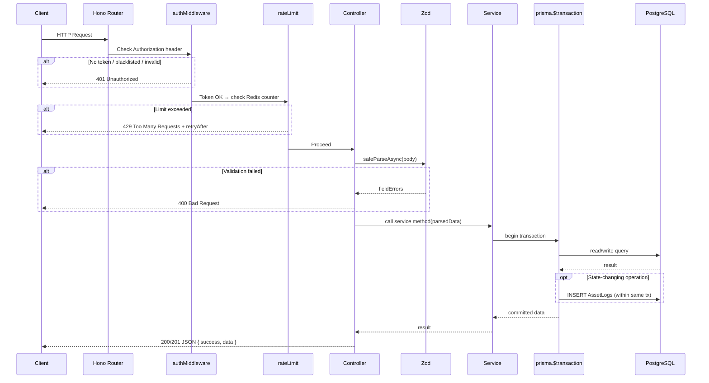
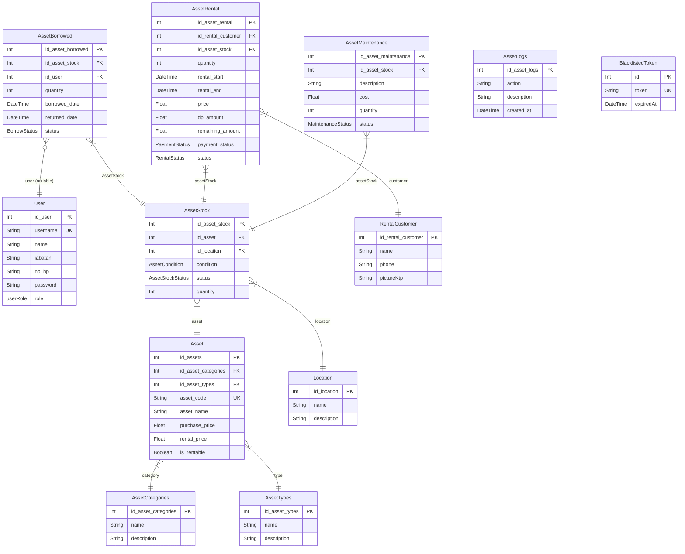

# API Inventory — Backend Documentation

> **Stack:** Bun · Hono · PostgreSQL · Prisma ORM · Zod · Redis · JWT
>
> **Note on Divisi:** The `Divisi` model and its related files exist in the codebase for historical reasons but are **no longer used** in the active system. The route is commented out and no endpoint is mounted for it.

---

## Table of Contents

1. [Project Overview](#1-project-overview)
2. [Tech Stack](#2-tech-stack)
3. [Project Structure](#3-project-structure)
4. [Architecture Layers](#4-architecture-layers)
5. [Request Lifecycle Flow](#5-request-lifecycle-flow)
6. [Database Schema](#6-database-schema)
7. [Middleware](#7-middleware)
8. [Endpoint Reference](#8-endpoint-reference)
   - [Auth](#81-auth--auth)
   - [User (Karyawan)](#82-user--user)
   - [Asset Category](#83-asset-category--assetctg)
   - [Asset Types](#84-asset-types--assettypes)
   - [Location](#85-location--location)
   - [Asset](#86-asset--asset)
   - [Asset Stock](#87-asset-stock--assetstock)
   - [Asset Borrow](#88-asset-borrow--assetborrow)
   - [Asset Rental](#89-asset-rental--assetrental)
   - [Rental Customer](#810-rental-customer--rentalcustomer)
   - [Asset Maintenance](#811-asset-maintenance--assetmaintenance)
   - [Asset Logs](#812-asset-logs--assetlogs)
   - [Statistics](#813-statistics--statistic)
9. [Asset Log Actions](#9-asset-log-actions)
10. [Retention Job](#10-retention-job)
11. [Environment Variables](#11-environment-variables)

---

## 1. Project Overview

`api_inventory` is a RESTful backend service for managing company asset inventory. It supports:

- **Master data management** (categories, types, locations, assets)
- **Physical stock tracking** per location, condition, and availability status
- **Internal borrowing** — employees borrow/use company assets
- **External rentals** — outside customers rent assets with payment tracking (DP, remaining balance)
- **Maintenance management** — track repair cycles, costs, and outcomes
- **System-wide audit logs** — every mutating operation appends an immutable log entry
- **Role-based access control** — ADMIN vs KARYAWAN

---

## 2. Tech Stack

| Component       | Technology                          |
|-----------------|-------------------------------------|
| Runtime         | [Bun](https://bun.sh)               |
| Web Framework   | [Hono](https://hono.dev) v4         |
| Database        | PostgreSQL                          |
| ORM             | [Prisma](https://prisma.io) v6      |
| Validation      | [Zod](https://zod.dev) v4           |
| Auth            | JWT via `jsonwebtoken`              |
| Rate Limiting   | Redis via `ioredis`                 |
| Password Hash   | `bcryptjs`                          |
| ID Generation   | `uuid`                              |

---

## 3. Project Structure

```
api_inventory/
├── prisma/
│   ├── schema.prisma          # All database models
│   └── migrations/            # Prisma migration history
├── src/
│   ├── index.ts               # App entrypoint — Hono init, route mounting, Bun.serve
│   ├── controllers/           # HTTP layer — request parsing, Zod validation, response
│   ├── services/              # Business logic layer — DB transactions, log emission
│   ├── routes/                # Route definitions — endpoint + middleware binding
│   ├── middleware/
│   │   ├── auth.middleware.ts # JWT verify, requireRole, requireSelfOrAdmin
│   │   ├── rateLimit.ts       # Redis-backed sliding window rate limiter
│   │   └── enableRegister.ts  # Feature flag for /auth/register
│   ├── validation/            # Zod schemas per entity
│   ├── utils/
│   │   ├── prisma.ts          # Prisma singleton
│   │   ├── redis.ts           # Redis singleton (ioredis)
│   │   ├── jwt.ts             # signToken / verifyToken helpers
│   │   ├── hash.ts            # bcrypt helpers
│   │   ├── asset-logs.ts      # createAssetLog + buildLogDescription utilities
│   │   ├── encryption.ts      # KTP image encryption helpers
│   │   ├── clearPicture.ts    # File cleanup utility
│   │   ├── history.ts         # History query helpers
│   │   └── unique_validation.ts # Prisma uniqueness check helpers
│   └── jobs/
│       └── retention.job.ts   # One-shot retention/cleanup script
├── .env.example               # All required environment variables with defaults
├── package.json
└── tsconfig.json
```

---

## 4. Architecture Layers

The codebase follows a strict 3-layer architecture:

```
Route → Middleware → Controller → Service → Prisma → Database
```

| Layer          | Responsibility                                                                                  |
|----------------|-------------------------------------------------------------------------------------------------|
| **Route**      | Declare HTTP method + path, wire middleware chain, point to controller handler                  |
| **Middleware** | Auth (JWT blacklist check + decode), Rate Limit (Redis counter per user/IP), Feature Flags      |
| **Controller** | Parse request params/body, run Zod `safeParseAsync`, call service, return structured JSON       |
| **Service**    | Core domain logic. Uses `prisma.$transaction` for atomicity. Calls `createAssetLog` on mutations |
| **Validation** | Zod schemas — `CreateXSchema`, `UpdateXSchema(id)` — enforce field rules before DB access       |
| **Utils**      | Shared helpers: JWT, Redis, logging, hashing, encryption                                        |

---

## 5. Request Lifecycle Flow



---

## 6. Database Schema

### Entity Relationship Diagram



### Enums

| Enum                | Values                                            |
|---------------------|---------------------------------------------------|
| `userRole`          | `ADMIN`, `KARYAWAN`                               |
| `AssetCondition`    | `BAIK`, `RUSAK`                                   |
| `AssetStockStatus`  | `TERSEDIA`, `TIDAK_TERSEDIA`, `MAINTENANCE`, `DIPINJAM`, `DIPAKAI`, `DISEWA` |
| `BorrowStatus`      | `DIPAKAI`, `DIPINJAM`, `DIKEMBALIKAN`, `TERLAMBAT`|
| `RentalStatus`      | `AKTIF`, `SELESAI`, `DIBATALKAN`                  |
| `PaymentStatus`     | `BELUM_BAYAR`, `DP`, `LUNAS`                      |
| `MaintenanceStatus` | `ON_PROGRESS`, `DONE`                             |

---

## 7. Middleware

### `authMiddleware`

Reads the `Authorization: Bearer <token>` header.

1. If header is missing → **401**
2. Checks `BlacklistedToken` table (logout revocation) → **401** if found
3. Verifies JWT signature and expiry → **401** if invalid
4. Stores decoded payload (`id`, `role`) in Hono context via `c.set('user', decoded)`

### `requireRole(...roles)`

Checks the decoded `user.role` against an allowlist.  
→ Returns **403 Forbidden** if role is not in the list.

### `requireSelfOrAdmin`

Used on endpoints where a KARYAWAN may only access their own record.  
→ ADMIN always passes. A KARYAWAN can only proceed if `user.id === param.id`.  
→ Returns **403** otherwise.

### `rateLimit(opts)`

Redis sliding-window rate limiter per `user.id` (authenticated) or IP (fallback).

```
Key format:  <keyPrefix>:<userId|IP>
Algorithm:   INCR key → set TTL on first hit → block if count > max
Response on limit:  429 { error, retryAfter }
```

All limits are configured per-operation via `.env` (see [Section 11](#11-environment-variables)).

### `enableRegister`

Feature flag middleware. Reads `ENABLE_REGISTER` from env.  
If `false`, the `/auth/register` endpoint returns 403.

---

## 8. Endpoint Reference

> **Legend:**
> - 🔒 = requires `authMiddleware`
> - 👑 = requires `requireRole("ADMIN")`
> - 🧑 = requires `requireSelfOrAdmin`
> - 🔑 = requires `requireRole("KARYAWAN","ADMIN")`

All responses follow the pattern:
```json
{ "success": true, "data": { ... } }
{ "success": false, "message": "...", "errors": { ... } }
```

---

### 8.1 Auth — `/auth`

| Method | Endpoint         | Middleware            | Description                                   |
|--------|------------------|-----------------------|-----------------------------------------------|
| POST   | `/auth/register` | `enableRegister`      | Register a new user (disabled by default via env) |
| POST   | `/auth/login`    | `rateLimit`           | Login with username + password → returns JWT  |
| POST   | `/auth/logout`   | 🔒 `rateLimit`        | Blacklists the current token in DB            |

**Login request body:**
```json
{ "username": "string", "password": "string" }
```

**Login response:**
```json
{ "success": true, "token": "<JWT>" }
```

---

### 8.2 User — `/user`

| Method | Endpoint       | Middleware                  | Description                               |
|--------|----------------|-----------------------------|-------------------------------------------|
| GET    | `/user`        | 🔒 `rateLimit`              | Get all users                             |
| GET    | `/user/:id`    | 🔒 🧑 `rateLimit`           | Get one user (self or admin only)         |
| POST   | `/user`        | 🔒 👑 `rateLimit`           | Create a single user (admin only)         |
| POST   | `/user/many`   | 🔒 👑 `rateLimit`           | Bulk create users (admin only)            |
| PUT    | `/user/:id`    | 🔒 👑 `rateLimit`           | Update a user (admin only)                |
| DELETE | `/user/:id`    | 🔒 👑 `rateLimit`           | Delete a user (admin only)                |

---

### 8.3 Asset Category — `/assetCtg`

| Method | Endpoint         | Middleware         | Description               |
|--------|------------------|--------------------|---------------------------|
| GET    | `/assetCtg`      | 🔒 `rateLimit`     | List all asset categories |
| GET    | `/assetCtg/:id`  | 🔒 `rateLimit`     | Get category by ID        |
| POST   | `/assetCtg`      | 🔒 `rateLimit`     | Create new category       |
| PUT    | `/assetCtg/:id`  | 🔒 `rateLimit`     | Update category           |
| DELETE | `/assetCtg/:id`  | 🔒 `rateLimit`     | Delete category           |

---

### 8.4 Asset Types — `/assetTypes`

| Method | Endpoint           | Middleware         | Description           |
|--------|--------------------|--------------------|-----------------------|
| GET    | `/assetTypes`      | 🔒 `rateLimit`     | List all asset types  |
| GET    | `/assetTypes/:id`  | 🔒 `rateLimit`     | Get type by ID        |
| POST   | `/assetTypes`      | 🔒 `rateLimit`     | Create new type       |
| PUT    | `/assetTypes/:id`  | 🔒 `rateLimit`     | Update type           |
| DELETE | `/assetTypes/:id`  | 🔒 `rateLimit`     | Delete type           |

---

### 8.5 Location — `/location`

| Method | Endpoint           | Middleware         | Description                      |
|--------|--------------------|--------------------|----------------------------------|
| GET    | `/location`        | 🔒 `rateLimit`     | List all storage locations       |
| GET    | `/location/:id`    | 🔒 `rateLimit`     | Get location by ID               |
| POST   | `/location`        | 🔒 `rateLimit`     | Create new location              |
| PUT    | `/location/:id`    | 🔒 `rateLimit`     | Update location                  |
| DELETE | `/location/:id`    | 🔒 `rateLimit`     | Delete location                  |

---

### 8.6 Asset — `/asset`

Master ledger of goods (e.g., "Laptop Dell XPS"). All write operations automatically create an `AssetLog` entry via `prisma.$transaction`.

| Method | Endpoint       | Middleware         | Description                                      |
|--------|----------------|--------------------|--------------------------------------------------|
| GET    | `/asset`       | 🔒 `rateLimit`     | List all assets (includes category + type names) |
| GET    | `/asset/:id`   | 🔒 `rateLimit`     | Get single asset by ID                           |
| POST   | `/asset`       | 🔒 `rateLimit`     | Create new asset → logs `ASSET_CREATE`           |
| PUT    | `/asset/:id`   | 🔒 `rateLimit`     | Update asset → logs `ASSET_UPDATE` (before/after)|
| DELETE | `/asset/:id`   | 🔒 `rateLimit`     | Delete asset → logs `ASSET_DELETE`               |

**Create / Update body fields:**
```json
{
  "id_asset_categories": 1,
  "id_asset_types": 2,
  "asset_code": "LPT-001",
  "asset_name": "Laptop Dell XPS",
  "purchase_price": 15000000,
  "rental_price": 150000,
  "is_rentable": true
}
```

---

### 8.7 Asset Stock — `/assetStock`

Physical instances of assets, uniquely identified by `(asset, location, condition, status)`. All write operations auto-log.

| Method | Endpoint           | Middleware         | Description                                        |
|--------|--------------------|--------------------|---------------------------------------------------|
| GET    | `/assetStock`      | 🔒 `rateLimit`     | Get all stock entries                              |
| GET    | `/assetStock/:id`  | 🔒 `rateLimit`     | Get stock entry by ID                              |
| POST   | `/assetStock`      | 🔒 `rateLimit`     | Create stock entry → logs `ASSET_STOCK_CREATE`    |
| PUT    | `/assetStock/:id`  | 🔒 `rateLimit`     | Update stock entry → logs `ASSET_STOCK_UPDATE`    |
| DELETE | `/assetStock/:id`  | 🔒 `rateLimit`     | Delete stock entry → logs `ASSET_STOCK_DELETE`    |

---

### 8.8 Asset Borrow — `/assetBorrow`

Handles internal asset usage by employees. Two creation modes: **borrow** (the item leaves temporarily) and **used** (the item is assigned for ongoing use).

| Method | Endpoint                 | Middleware                | Description                                                  |
|--------|--------------------------|---------------------------|--------------------------------------------------------------|
| GET    | `/assetBorrow`           | 🔒 🔑 `rateLimit`         | List all borrow/used records (KARYAWAN or ADMIN)             |
| GET    | `/assetBorrow/:id`       | 🔒 🧑 `rateLimit`         | Get single record (self or admin)                            |
| POST   | `/assetBorrow/used`      | 🔒 👑 `rateLimit`         | Assign stock as **in-use** (ADMIN only) → logs `USED_CREATE`|
| POST   | `/assetBorrow/borrow`    | 🔒 🔑 `rateLimit`         | Borrow stock (KARYAWAN or ADMIN) → logs `BORROW_CREATE`     |
| PUT    | `/assetBorrow/:id/return`| 🔒 `rateLimit`            | Return a borrowed/used asset → logs `BORROW_RETURN` or `USED_RETURN` |
| DELETE | `/assetBorrow/:id`       | 🔒 `rateLimit`            | Delete a borrow record                                       |

**Borrow Flow:**
```
POST /assetBorrow/borrow
→ Validates stock availability
→ Reduces stock quantity / updates status to DIPINJAM (or DIPAKAI for /used)
→ Creates AssetBorrowed record
→ Logs event (within transaction)

PUT /assetBorrow/:id/return
→ Restores stock status to TERSEDIA
→ Updates returned_date + status = DIKEMBALIKAN
→ Logs BORROW_RETURN / USED_RETURN
```

---

### 8.9 Asset Rental — `/assetRental`

Handles external customer rentals with financial tracking.

| Method | Endpoint                    | Middleware         | Description                                        |
|--------|-----------------------------|--------------------|----------------------------------------------------|
| GET    | `/assetRental`              | 🔒 `rateLimit`     | List all rental records                            |
| GET    | `/assetRental/:id`          | 🔒 `rateLimit`     | Get rental by ID                                   |
| POST   | `/assetRental`              | 🔒 `rateLimit`     | Create rental → logs `RENTAL_CREATE`               |
| PUT    | `/assetRental/:id/finish`   | 🔒 `rateLimit`     | Mark rental as finished → logs `RENTAL_FINISH`     |
| PUT    | `/assetRental/:id/pay`      | 🔒 `rateLimit`     | Record a payment → logs `RENTAL_PAYMENT`           |
| PUT    | `/assetRental/:id/cancel`   | 🔒 `rateLimit`     | Cancel rental → logs `RENTAL_CANCEL`               |

> **Note:** DELETE endpoints for rentals are currently commented out (non-active rentals only).

**Rental Flow:**
```
POST /assetRental
→ Validates rental_start < rental_end
→ Checks stock is_rentable + availability
→ Stock status → DISEWA
→ Sets price, dp_amount, remaining_amount, payment_status
→ Logs RENTAL_CREATE

PUT /assetRental/:id/pay
→ Updates dp_amount / remaining_amount
→ Updates payment_status (BELUM_BAYAR → DP → LUNAS)
→ Logs RENTAL_PAYMENT

PUT /assetRental/:id/finish
→ Sets status = SELESAI, returned_date = now
→ Stock status → TERSEDIA (or RUSAK based on image_after_rental)
→ Logs RENTAL_FINISH

PUT /assetRental/:id/cancel
→ Sets status = DIBATALKAN
→ Stock status → TERSEDIA
→ Logs RENTAL_CANCEL
```

---

### 8.10 Rental Customer — `/rentalCustomer`

Manages profiles of external customers who rent assets.

| Method | Endpoint                 | Middleware         | Description                               |
|--------|--------------------------|--------------------|-------------------------------------------|
| GET    | `/rentalCustomer`        | 🔒 `rateLimit`     | List all rental customers                 |
| GET    | `/rentalCustomer/:id`    | 🔒 `rateLimit`     | Get customer by ID                        |
| POST   | `/rentalCustomer`        | 🔒 `rateLimit`     | Create customer → logs `RENTAL_CUSTOMER_CREATE` |
| PUT    | `/rentalCustomer/:id`    | 🔒 `rateLimit`     | Update customer → logs `RENTAL_CUSTOMER_UPDATE` |
| DELETE | `/rentalCustomer/:id`    | 🔒 `rateLimit`     | Delete customer → logs `RENTAL_CUSTOMER_DELETE` |

> KTP photo is stored encrypted via `encryption.ts`. The field `pictureKtp` holds the encrypted value.

---

### 8.11 Asset Maintenance — `/assetMaintenance`

Tracks asset repair cycles with status and cost tracking.

| Method | Endpoint                        | Middleware         | Description                                       |
|--------|---------------------------------|--------------------|---------------------------------------------------|
| GET    | `/assetMaintenance`             | 🔒 `rateLimit`     | List all maintenance records                      |
| GET    | `/assetMaintenance/:id`         | 🔒 `rateLimit`     | Get maintenance record by ID                      |
| POST   | `/assetMaintenance`             | 🔒 `rateLimit`     | Start maintenance → logs `MAINTENANCE_CREATE`     |
| PUT    | `/assetMaintenance/:id/return`  | 🔒 `rateLimit`     | Complete maintenance → logs `MAINTENANCE_DONE`    |
| DELETE | `/assetMaintenance/:id`         | 🔒 `rateLimit`     | Delete record                                     |

**Maintenance Flow:**
```
POST /assetMaintenance
→ Stock status → MAINTENANCE
→ Creates AssetMaintenance record (status = ON_PROGRESS)
→ Logs MAINTENANCE_CREATE

PUT /assetMaintenance/:id/return
→ Maintenance status → DONE
→ Stock status → TERSEDIA (or RUSAK, depending on final condition)
→ Logs MAINTENANCE_DONE
```

---

### 8.12 Asset Logs — `/assetLogs`

Read-only audit trail. All entries are system-generated from within service transactions. No POST/PUT/DELETE endpoints.

| Method | Endpoint                     | Description                                  |
|--------|------------------------------|----------------------------------------------|
| GET    | `/assetLogs`                 | Get all logs (paginated, newest first)       |
| GET    | `/assetLogs/:id`             | Get single log by ID                         |
| GET    | `/assetLogs/location`        | Logs filtered by location-related actions    |
| GET    | `/assetLogs/rental-customer` | Logs for rental customer actions             |
| GET    | `/assetLogs/user`            | Logs for user (karyawan) actions             |
| GET    | `/assetLogs/asset`           | Logs for asset master data actions           |
| GET    | `/assetLogs/asset-stock`     | Logs for asset stock actions                 |
| GET    | `/assetLogs/types`           | Logs for asset type actions                  |
| GET    | `/assetLogs/categories`      | Logs for asset category actions              |
| GET    | `/assetLogs/rental`          | Logs for rental lifecycle actions            |
| GET    | `/assetLogs/borrow`          | Logs for borrow/used lifecycle actions       |
| GET    | `/assetLogs/maintenance`     | Logs for maintenance lifecycle actions       |

> All routes under `/assetLogs` require `authMiddleware` and their own `rateLimit` token.

---

### 8.13 Statistics — `/statistic`

Aggregated read-only metrics for dashboard display.

| Method | Endpoint                          | Description                                              |
|--------|-----------------------------------|----------------------------------------------------------|
| GET    | `/statistic/getDashboardSummary`  | Total assets, users, active rentals, total asset value, etc. |
| GET    | `/statistic/rankCtgByStock`       | Categories ranked by total stock quantity                |
| GET    | `/statistic/get5LatestLogs`       | 5 most recent system log entries                         |
| GET    | `/statistic/rentalSummary`        | Revenue and rental status breakdown                      |
| GET    | `/statistic/BorrowSummary`        | Borrowing activity breakdown                             |

---

## 9. Asset Log Actions

Every mutating operation emits one of these typed action strings to `AssetLogs`:

| Category          | Actions                                                             |
|-------------------|---------------------------------------------------------------------|
| **Asset**         | `ASSET_CREATE`, `ASSET_UPDATE`, `ASSET_DELETE`                      |
| **Asset Stock**   | `ASSET_STOCK_CREATE`, `ASSET_STOCK_UPDATE`, `ASSET_STOCK_DELETE`    |
| **Categories**    | `ASSET_CATEGORIES_CREATE`, `ASSET_CATEGORIES_UPDATE`, `ASSET_CATEGORIES_DELETE` |
| **Types**         | `ASSET_TYPE_CREATE`, `ASSET_TYPE_UPDATE`, `ASSET_TYPE_DELETE`       |
| **Location**      | `LOCATION_CREATE`, `LOCATION_UPDATE`, `LOCATION_DELETE`             |
| **User**          | `USER(KARYAWAN)_CREATE`, `USER(KARYAWAN)_UPDATE`, `USER(KARYAWAN)_DELETE` |
| **Rental Customer**| `RENTAL_CUSTOMER_CREATE`, `RENTAL_CUSTOMER_UPDATE`, `RENTAL_CUSTOMER_DELETE` |
| **Borrow**        | `BORROW_CREATE`, `BORROW_RETURN`, `USED_CREATE`, `USED_RETURN`      |
| **Rental**        | `RENTAL_CREATE`, `RENTAL_FINISH`, `RENTAL_PAYMENT`, `RENTAL_CANCEL` |
| **Maintenance**   | `MAINTENANCE_CREATE`, `MAINTENANCE_DONE`                            |
| **Other**         | `STOCK_UPDATE`, `STOCK_MOVE`, `DELETE_HISTORY`, `OTHER`             |

**Log description format** (generated by `buildLogDescription`):
```
<title> | <detail> | META={"key":"value",...}
```

Example:
```
Asset dibuat | Asset "Laptop Dell XPS(LPT-001)" berhasil dibuat | META={"id_asset":1,"asset_name":"Laptop Dell XPS",...}
```

---

## 10. Retention Job

A **one-shot cleanup script** (`src/jobs/retention.job.ts`) that purges old historical data.  
Run manually or via a cron scheduler:

```bash
bun run retention
# or
bun src/jobs/retention.job.ts
```

Controlled entirely by environment variables:

| Variable                  | Default | Description                               |
|---------------------------|---------|-------------------------------------------|
| `RETENTION_ENABLED`       | `true`  | Master switch — set to `false` to disable |
| `RETENTION_LOGS_DAYS`     | `180`   | Delete `AssetLogs` older than N days      |
| `RETENTION_BORROW_DAYS`   | `365`   | Delete `AssetBorrowed` older than N days  |
| `RETENTION_RENTAL_DAYS`   | `365`   | Delete `AssetRental` older than N days    |
| `RETENTION_MAINTENANCE_DAYS` | `365` | Delete `AssetMaintenance` older than N days |

The job disconnects Prisma and exits cleanly after completion.

---

## 11. Environment Variables

Copy `.env.example` to `.env` and fill in:

### Core

| Variable          | Description                                           |
|-------------------|-------------------------------------------------------|
| `DATABASE_URL`    | PostgreSQL connection string                          |
| `REDIS_URL`       | Redis connection URL (required for rate limiting)     |
| `PORT`            | Server port (default: `3000`)                         |
| `JWT_SECRET`      | Secret key for signing JWTs                           |
| `TokenExpired`    | JWT expiry in seconds (default: `3600` = 1 hour)     |
| `KTP_SECRET_KEY`  | 32-byte key for encrypting KTP photo data             |
| `ENABLE_REGISTER` | `true`/`false` — enables the `/auth/register` route   |

### Rate Limit — Global

| Variable               | Default | Description                        |
|------------------------|---------|------------------------------------|
| `rl_read_windowsSecs`  | `10`    | Window size (sec) for GET requests |
| `rl_read_max`          | `100`   | Max GET requests per window        |
| `rl_write_windowsSecs` | `10`    | Window size for POST/PUT requests  |
| `rl_write_max`         | `50`    | Max write requests per window      |
| `rl_delete_windowsSecs`| `10`    | Window size for DELETE requests    |
| `rl_delete_max`        | `15`    | Max DELETE requests per window     |

### Rate Limit — Per Operation Key Prefixes

Each endpoint uses a unique Redis key prefix to allow fine-grained monitoring. They are defined in `.env.example` and follow the naming pattern:

```
<module>_<operation>_prefix="rl:<descriptiveName>"
```

Examples: `asset_get_keyPrefix`, `borrow_return_keyPrefix`, `asset_rentalFinish_prefix`

See `.env.example` for the full list of ~50 rate limit key prefix variables.

### Retention

| Variable                      | Default |
|-------------------------------|---------|
| `RETENTION_ENABLED`           | `true`  |
| `RETENTION_LOGS_DAYS`         | `180`   |
| `RETENTION_BORROW_DAYS`       | `365`   |
| `RETENTION_RENTAL_DAYS`       | `365`   |
| `RETENTION_MAINTENANCE_DAYS`  | `365`   |

---

## Running the Project

```bash
# Development (hot reload)
bun run dev

# Production
bun run start

# Generate Prisma client
bun run build

# Run retention cleanup job
bun run retention
```

> **Requirements:** PostgreSQL and Redis must be running and accessible via `DATABASE_URL` and `REDIS_URL`.
